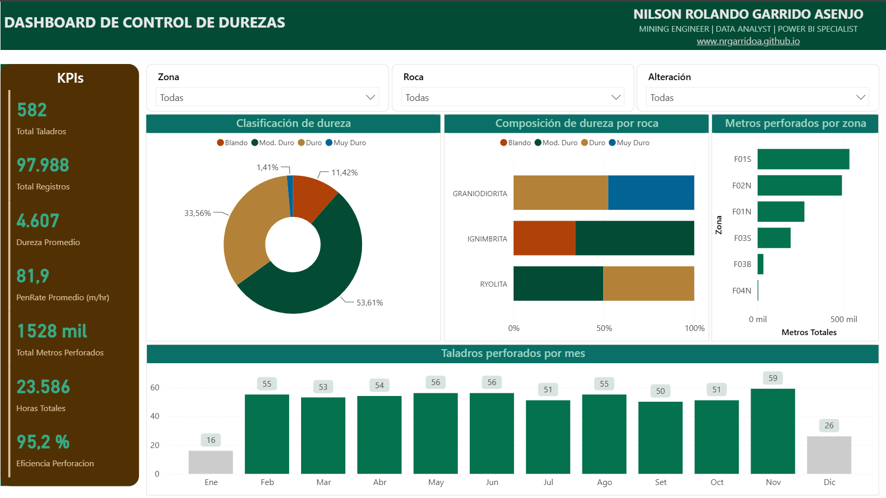
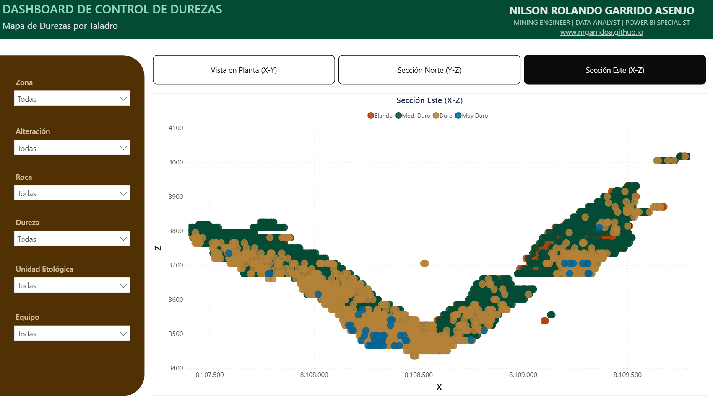
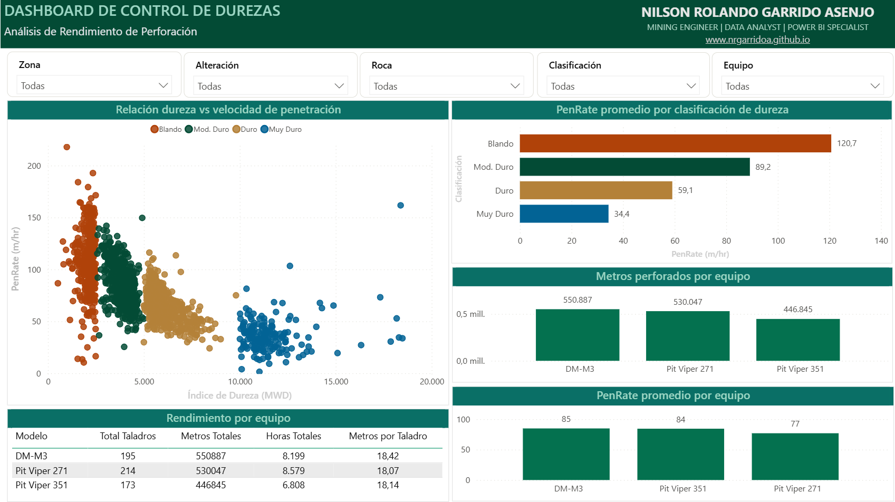
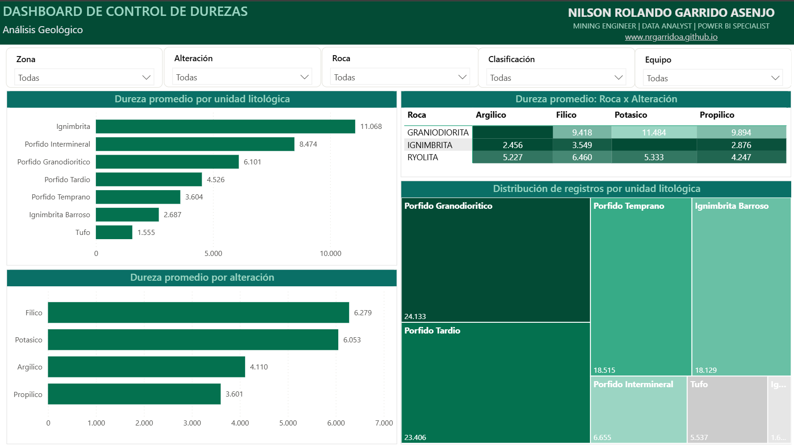

#### Found this useful? Support it with a [](https://github.com/nrgarridoa/pbi-control-durezas/stargazers) on the repository.

---

# Hardness Control — Drilling & Blasting Dashboard · Open Pit

> **In drilling and blasting, not knowing rock hardness before you drill costs money: broken bits, underperforming rigs, inefficient blasts, and production delays. This dashboard turns 97,988 MWD records into operational intelligence — the difference between planning blind and deciding with data.**

Interactive dashboard that converts raw MWD (Measurement While Drilling) data into a geospatial hardness map, equipment performance analysis, and geological patterns — all filterable in real time for superintendents, drill supervisors, and geologists.

[](https://app.powerbi.com/view?r=eyJrIjoiZTlkZTNjMjctOWNkMC00MzE0LWEwZWEtMDIwM2NiNjI4MDU4IiwidCI6ImY3YWNmODc2LWU3ZTgtNDQ0Yy05NWFlLWY5NTQ4YWNmZTMyZiIsImMiOjR9)

<sub>🇬🇧 English · [🇪🇸 Español](README.md)</sub>

---

## Preview

<div align="center">
  
  <br/><br/>
  
  
  
</div>

---

## What problem does it solve

| Without this dashboard | With this dashboard |
|---|---|
| Hardness is only known **after** drilling | Geospatial hardness map to plan **before** |
| No visibility on which rig performs best per zone | PenRate comparison by equipment and rock type |
| Geologists and drillers work with separate data | Single source of truth with cross-filtering |
| Reports are static and delayed | Interactive dashboard updatable in real time |
| Sensor errors go undetected | Cleaned and validated data (98% quality) |

---

## Key findings

**1. Hardness controls performance**
- Soft rock: **120.7 m/hr** penetration rate
- Very hard rock: **34.4 m/hr** — nearly 4× slower
- Direct impact on cost per drilled meter and bit consumption

**2. Alteration matters as much as lithology**
- Phyllic and potassic alteration produce rock **~40% harder** than argillic
- A blast hole in a phyllic zone takes longer and wears bits faster

**3. Not all rigs perform equally per zone**
- DM-M3: 85 m/hr average — highest cumulative production (551 K meters)
- Pit Viper 351: 77 m/hr — lower production but fewer operating hours
- Key data for assigning equipment based on expected hardness per zone

**4. 95.2% drilling efficiency**
- Actual vs. planned depth shows high operational compliance
- Jan and Dec are partial months (16 and 26 blast holes) — adjust YoY comparisons accordingly

---

## How to explore the live dashboard

In the [interactive dashboard](https://app.powerbi.com/view?r=eyJrIjoiZTlkZTNjMjctOWNkMC00MzE0LWEwZWEtMDIwM2NiNjI4MDU4IiwidCI6ImY3YWNmODc2LWU3ZTgtNDQ0Yy05NWFlLWY5NTQ4YWNmZTMyZiIsImMiOjR9):

- **Slicers:** filter by zone, alteration, rock type, hardness class, lithology, or equipment — all visuals respond simultaneously.
- **Cross-filtering:** click any bar, point, or slice and the rest adjusts.
- **Geospatial map:** use bookmarks (Plan View / North Section / East Section) to switch pit perspective.
- **Tooltips:** hover over any point on the map to see 9 fields: coordinates, zone, equipment, hardness, PenRate, depth, and more.

---

## The data

The model is built on 6 tables in a star schema:

| Table | Main content | Records | Type |
|---|---|:---:|---|
| Fact_Dureza | Hardness, PenRate, UTM coordinates, meters, hours per pass | 97,988 | Fact |
| Dim_Taladro | Blast holes: zone, equipment, planned/actual depth | 582 | Dimension |
| Dim_Dureza | Class: Soft / Mod. Hard / Hard / Very Hard | 4 | Dimension |
| Dim_Equipo | Model, manufacturer, pulldown, weight | 6 | Dimension |
| Dim_GrupoLito | ISRM R0–R6 classification | 7 | Dimension |
| Dim_Calendario | Date hierarchy Jan 2024–Jan 2025 | 397 | Dimension |

> **Origin:** Synthetic data generated with distributions calibrated to real parameters from copper porphyry operations in the Peruvian highlands. No raw data is used as-is — everything goes through a cleaning and ETL process documented in the private repository.

---

## Dashboard pages

- **Summary** — 7 global KPIs: blast holes, MWD records, average hardness, PenRate, efficiency, meters, and hours. Hardness distribution by lithology and monthly trend.
- **Hardness Map by Blast Hole** — Geospatial visualization in 3 views (plan X-Y, north section Y-Z, east section X-Z). Each point = 1 MWD record, colored by hardness class. 6 slicers.
- **Performance Analysis** — PenRate vs Hardness scatter (inverse relationship). Production and performance comparison by equipment.
- **Geological Analysis** — Hardness across 7 lithological units. Rock × Alteration heatmap. Lithological distribution treemap.

---

## Measures and calculations

DAX measures are organized in the `_Medidas` table, grouped by folders:

| Folder | What it solves | Examples |
|---|---|---|
| KPIs | Global indicators for the summary panel | Total Blast Holes, Average PenRate, Drilling Efficiency |
| Production | Cumulative volume by period or equipment | Total Meters, Total Hours, Meters per Blast Hole |
| Performance | Speed comparisons by hardness class | PenRate by Class, PenRate Variation |

> Full DAX code and logic are documented in the private repository.

---

<details>
<summary><strong>Technical approach — click to expand</strong></summary>

### Data model

Star schema: 1 central fact table + 5 dimensions.

```
                    Dim_Calendario (397)
                          │ 1
                          │ N
Dim_Equipo (6) ──1        │        1── Dim_Dureza (4)
             │  N         ▼       N │
             └──── Dim_Taladro ──── Fact_Dureza (97 988) ────N──1── Dim_GrupoLito (7)
                    (582)  1──N ──►
```

| Table | Rows | Relates to | Cardinality |
|---|:---:|---|:---:|
| Fact_Dureza | 97,988 | central fact table | — |
| Dim_Taladro | 582 | Fact_Dureza | 1 : N |
| Dim_Dureza | 4 | Fact_Dureza | 1 : N |
| Dim_Calendario | 397 | Dim_Taladro | 1 : N |
| Dim_GrupoLito | 7 | Fact_Dureza | 1 : N |
| Dim_Equipo | 6 | Dim_Taladro | 1 : N |

### Key design decisions

- **No base map:** coordinate data is confidential in real operations; a custom scatter plot in local UTM coordinates was used with bookmarks for perspective switching — achieving the same effect without exposing exact location.
- **9-field tooltip:** designed so the driller or geologist gets all information about a point without leaving the visual.
- **Hardness palette using brand colors:** Verde Mineral `#2D936C` · Azul Acero `#2E86AB` · Naranja Cobre `#E8751A` · Rojo Arcilla `#C1292E` — consistent across all pages so the pattern is immediately recognizable.

### Stack

| Tool | Use |
|---|---|
| Power BI Desktop | Model and dashboard development |
| Power Query (M) | ETL, cleaning and data typing |
| DAX | Measures, KPIs and calculated columns |
| Python / Pillow | Brand asset generation (social preview, card thumb) |
| Git / GitHub | Version control and publishing |
| Power BI Service | Publishing and web embed |

> The fully reproducible detail (`.pbix`, data, documented DAX, scripts) is in the private repository — available on request.

</details>

---

## Structure

### Public repository (this repository)

```
pbi-control-durezas/
├── docs/
│   ├── summary.png
│   ├── hardness.png
│   ├── performance.png
│   └── geology.png
├── social-preview.png
├── thumb.png
├── LICENSE
└── README.md
```

### Full project (private repository — access on request)

```
pbi-control-durezas-source/
├── pbix/
│   └── Control de durezas - Dashboard.pbix
├── data/
│   └── processed/
│       ├── Fact_Dureza.csv
│       ├── Dim_Taladro.csv
│       ├── Dim_Dureza.csv
│       ├── Dim_Equipo.csv
│       ├── Dim_GrupoLito.csv
│       └── Dim_Calendario.csv
├── docs/
├── scripts/
│   ├── gen_social_preview.py
│   └── gen_card_thumb.py
├── Tema_ControlDurezas.json
├── social-preview.png
├── thumb.png
├── CHANGELOG.md
├── LICENSE
└── README.md
```

---

## Author

### Nilson Rolando Garrido Asenjo
**Mining Engineer · Industrial Manager · Power BI Developer · Python Developer · Data Analyst**

[](https://nrgarridoa.github.io)
[](https://www.linkedin.com/in/nrgarridoa)
[](https://www.youtube.com/@nrgarridoa)
[](mailto:nrgarridoa@gmail.com)
[](https://github.com/nrgarridoa)

Mining Engineer and Industrial Manager with 10+ years of experience; operational track record at Newmont Yanacocha, Gold Fields, and Silver Mountain; Project Manager at CODEa UNI and consultant for Chinalco and Antamina. Accredited drone pilot with surface operations (photogrammetry, volumetrics) and underground (LiDAR with Elios 3 for Flyability). Instructor of Power BI and Python applied to mining.

> Want to see the full project (`.pbix`, model, documented DAX)? I provide guided access to the private repository on request.

---

## License

Content under **[CC BY-NC-ND 4.0](LICENSE)** — you may view and share it with credit, no commercial use or derivatives. © 2026 Nilson Rolando Garrido Asenjo.
